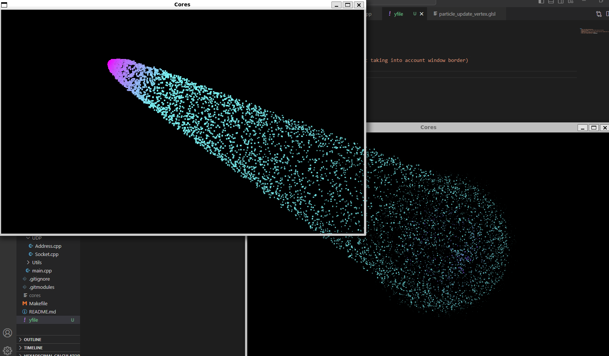
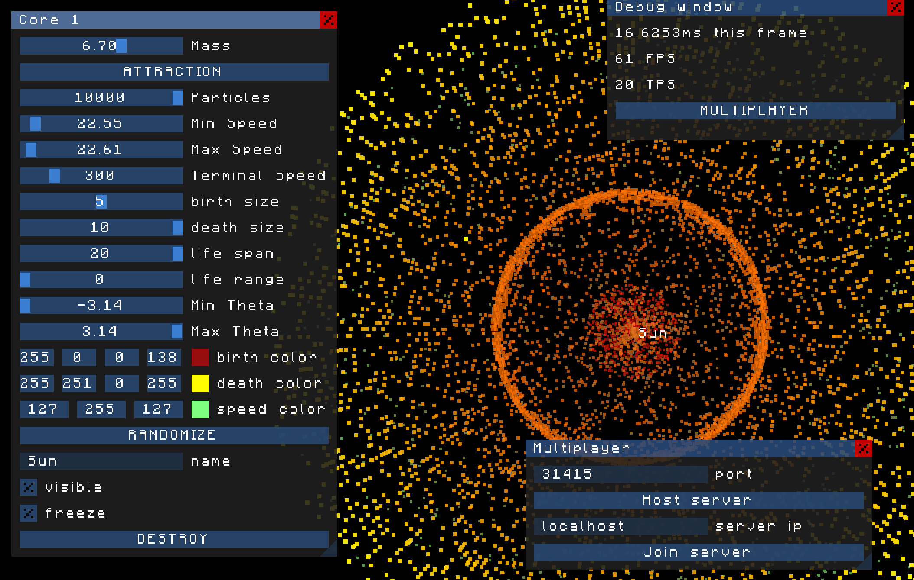

# Cores
Playing around with particules in openGL.



## About
I needed a project to get my hands on transform feedbacks in openGL, and here it is. I am hoping to create a nice background screen shared by all computers on the same local networks, each station being able to generate particule-emitting cores, resulting in cooperative creations.

## Building
```
$ git clone --recurse-submodules git@github.com:GitHuberlandYann/Cores.git
$ cd Cores
$ make setup
$ make
$ ./cores
```
make setup will install the needed [static libraries.](#libraries)

make will create the executable 'cores'.

## Multiplayer
Multiplayer is available on this project.  It uses UDP sockets and was structured with the project [VOX](https://github.com/GitHuberlandYann/VOX.git) in mind, as my goal is to implement multiplayer on the local network for my minecraft clone.  I first made a [multiplayer game of chess](https://github.com/GitHuberlandYann/multiChesser.git), by using TCP sockets, but after reading these [great articles about Game Networking](https://gafferongames.com/categories/game-networking/) by Glenn Fiedler, I chose to turn myself towards UDP sockets, and this project was born.

To enable multiplayer, press F3, then click on the MULTIPLAYER button, it will open a new Gui window. You can then either host a server or join an existing one on your local network. Once connected to a server, you can only control one Core, whose gui window you can open and close by pressing 1. There can be up to 8 other cores than yours on the screen, each controlled by another client on the server.

## GUI
I coded my own Gui window management. It allows to create several customizable gui windows on screen, on which you can add sliders, display values, modify color channels, and more. It was inspired from [Dear ImGui](https://github.com/ocornut/imgui.git), and is used to customize your cores' properties, connect yourself to a server, and display useful informations.



## Controls
When the program starts, there is one core at the center of the window, emitting particles.
You can left click to move the core around.

If you hold right click, your cursor will attract particles.

By pressing 123456789, you can change the core you are currently controlling, if you press a number higher than the number of cores, a new core will be generated.  You can generate up to 9 cores.  Each core will attract the particles of the other cores.

Pressing 123456789 also opens a custom ui window to control the core you selected, it alows you to tweak the core's properties.

The cores' positions are absolute, meaning that when you drag the window accross the screen, the cores don't move along.

To see current fps and other infos, press F3.

## Libraries
* [GLFW](https://github.com/glfw/glfw.git) is an Open Source, multi-platform library for OpenGL, OpenGL ES and Vulkan application development. It provides a simple, platform-independent API for creating windows, contexts and surfaces, reading input, handling events, etc.
* [GLEW](https://github.com/nigels-com/glew.git) provides efficient run-time mechanisms for determining which OpenGL extensions are supported on the target platform. I am using the [latest stable version.](https://github.com/nigels-com/glew/releases/tag/glew-2.2.0)
* [SOIL](https://github.com/littlstar/soil.git) is a tiny C library used primarily for uploading textures into OpenGL.
